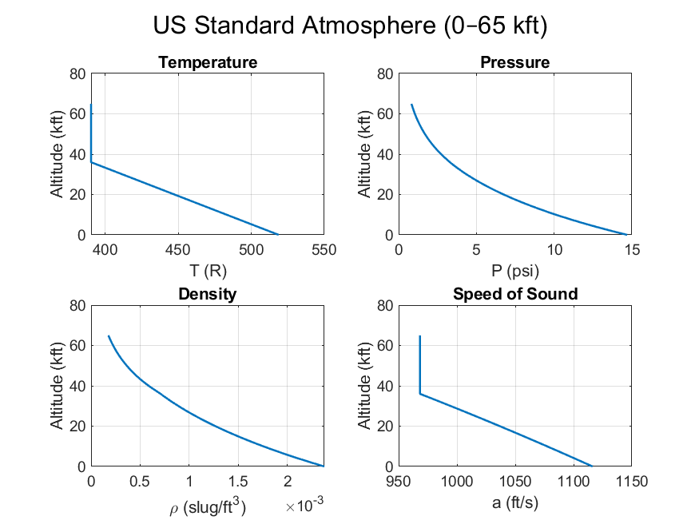

# Standard-Atmosphere-MATLAB
Standard Atmosphere calculator in MATLAB for aircraft performance analysis, with tabular and graphical outputs.

This project models the U.S. Standard Atmosphere from 0–65,000 ft using MATLAB.  
# Features
- Computes temperature, pressure, density, viscosity, and speed of sound vs altitude.
- Implements ISA lapse-rate and isothermal models, the ideal gas law, and Sutherland’s law.
- Generates tabular outputs and 4-panel plots (Temperature, Pressure, Density, Speed of Sound).
- Includes Mach number calculations for a given true airspeed.
- # Usage
1. Open `standard_atmosphere.m` in MATLAB.  
2. Run the script to generate atmosphere tables and plots.  
# Example Output

